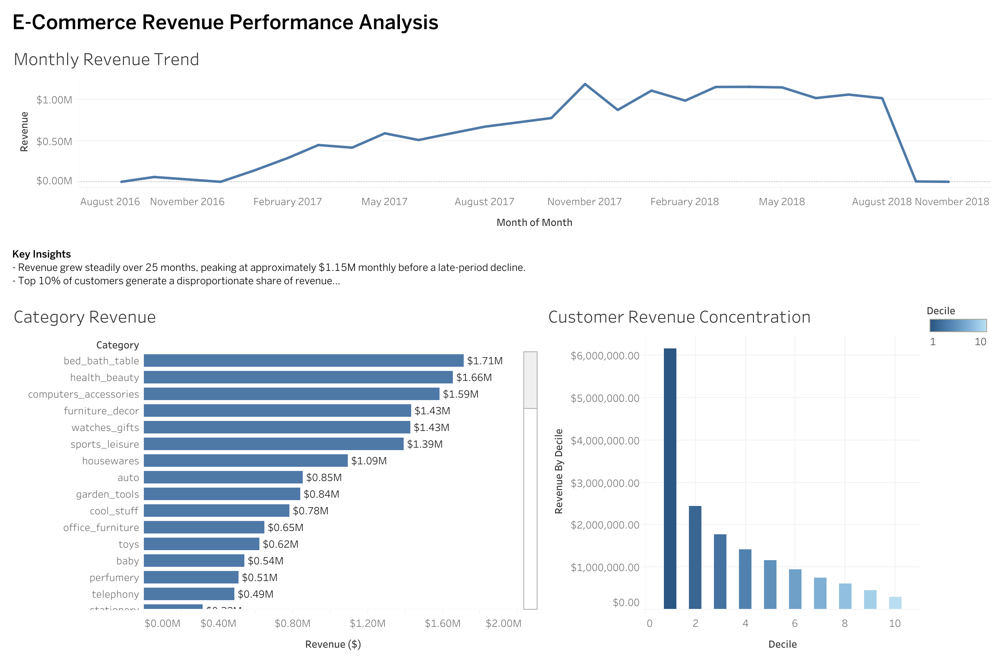

E-Commerce Revenue Performance Analysis

SQL + Tableau Business Intelligence Project

Live Dashboard: [View on Tableau Public](https://public.tableau.com/views/E-CommerceRevenuePerformanceAnalysis/Dashboard1?:language=en-US&publish=yes&:sid=&:redirect=auth&:display_count=n&:origin=viz_share_link)

Project Overview

	This project analyzes revenue performance for an e-commerce business using SQL and Tableau.
	The objective was to:
	Identify overall revenue trends
	Determine top-performing product categories
	Analyze customer revenue concentration
	Extract actionable business insights
	The project combines SQL data analysis with Tableau dashboard visualization to simulate a real-world business intelligence workflow.

Project Structure

	SQL/ → Analysis queries
	Data/ → Aggregated datasets used for dashboard
	Raw_Data/ → Original Olist dataset files
	Dashboard/ → Tableau dashboard preview
	README.md → Project documentation

Tools & Technologies

	SQLite – Data storage and querying
	SQL – Data extraction and aggregation
	Tableau Public – Dashboard visualization
	GitHub – Project documentation

Key Business Questions

	How has revenue trended over time?
	Which product categories drive the most revenue?
	Is revenue concentrated among a small group of customers?
	What strategic insights can be derived from this data?

Analysis & Insights

	Monthly Revenue Trend
		Revenue increased steadily over a 25-month period.
		Peak monthly revenue reached approximately $1.15M.
		A sharp decline appears at the end of the dataset (likely incomplete data or reporting cutoff).
		Insight: The business shows strong growth momentum but requires validation of late-period data.

	Category Revenue Analysis
		Top revenue-generating categories:
		Bed & Bath
		Health & Beauty
		Computers & Accessories
		Lower-performing categories include toys and baby products.
		Insight: Marketing and inventory investment should prioritize high-performing categories.

	Customer Revenue Concentration
		Revenue distribution across customer deciles shows:
		Top 10% of customers contribute a disproportionate share of revenue.
		Revenue sharply declines across lower deciles.
		Insight: The business exhibits strong revenue concentration.
		Retention strategies for top-tier customers are critical.

Dashboard

	The interactive Tableau dashboard includes:
	Monthly Revenue Trend
	Category Revenue Breakdown
	Customer Revenue Concentration Analysis
	https://public.tableau.com/views/E-CommerceRevenuePerformanceAnalysis/Dashboard1?:language=en-US&publish=yes&:sid=&:redirect=auth&:display_count=n&:origin=viz_share_link

Business Recommendations

	Implement VIP loyalty programs for top 10% customers
	Increase ad spend on top-performing product categories
	Investigate revenue drop in final months
	Explore cross-sell opportunities across leading categories

What This Project Demonstrates

	SQL aggregation & grouping
	Business KPI analysis
	Revenue concentration modeling
	Data storytelling
	Dashboard design best practices

How to Reproduce

	Load dataset into SQLite.
	Run queries located in the /SQL folder.
	Export results to CSV.
	Import into Tableau for visualization.

Author

Ajae Krishnan
Business Analytics | Data Analysis | SQL | Tableau

LinkedIn: www.linkedin.com/in/ajaek

